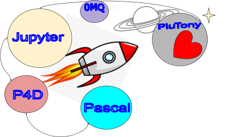

# What is PluTony?

PluTony was born as an experiment with the objective of "connecting" [\[Jupyter\]](https://jupyter.org), with programs made in Pascal.

The concept "connect" is intentionally ambiguous. Since there are many ways to connect and not all of them may be useful in the real world of your application scenario.

> * One thing is that from jupyter you read data from files generated by an application or read data from a Rest server made in Pascal.
> * Another thing is that from jupyter you can interact with libraries and code made in Pascal using Python.
> * And one more is to use Pascal scripts from Jupyter.
> * Or to be able to combine Pascal built into Python, or Python built into Pascal.

> There are also many combinations regarding the objectives, if you want to essentially consume data, or be able to interact with code in one or more languages.
>
> Also, where is the data being consumed from, from a lab application on your computer? From an application on your local network? From a computer on the internet? Or how about from Google Colab?

## Getting Started

****

An obvious way to get data is to generate json or csv files and read them from jupyter. Somewhat more sophisticated, you can run your program passing parameters and get a variable result. But it is not my goal to delve into this way, as it is described elsewhere (the bass kernel) and is not unique to Delphi.

This text is a small guide that describes some ways to make this connection using popular libraries. As if it were a trip I will call them routes, and in which I will try to describe the path. The source code encapsulates these connections, in the simplest possible and composable structures, which you can combine according to the context.

 
> 
> The code in [**\[MVP\]**](https://en.wikipedia.org/wiki/Minimum\_viable\_product) Each component has a complete functionality, but in minimal expression.
> 

### Routes/Guides:

This text is a small guide that describes some ways to make this connection using popular libraries. As if it were a trip I will call them routes, and in which I will try to describe the path. The source code encapsulates these connections, in the simplest possible and composable structures, which you can combine according to the context.

* [hello-jupyter.md](guides/hello-jupyter.md)

* [hello-plutony.md](guides/hello-plutony.md)

* [hello-script.md](guides/hello-script.md)

> 
> This guides matches with source code samples.
> 

### Fundamentals: 

Some concepts and  dependences. 

* [What is Jupyter](fundamentals/what-is-jupyter.md)
* [Python vs Pascal](fundamentals/python-vs-pascal.md)
* [Other project dependences](fundamentals/project-dependences.md)

> 
> Splitting PluTony into fundamental concepts, objects, or areas.
> 
> 