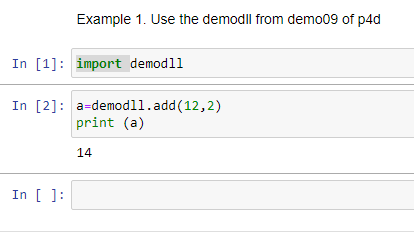

# Hello Jupyter

> 
> **Good to know:** [\[Jupyter\]](https://jupyter.org) can import \*.pyd files as a Python module and execute published functions using python syntax.
> 
## The basics

The example demo09 from the Python4Delphi library is a first example and is perfectly executable from Jupyter.

This is the first contact between Jupyter and Delphi, there is no more mystery.

This can already have many uses. You can use that example to do the first tests, include some new function. Create small modules with more or less complex functions in delphi that are executed like any other python program.

This is the essence and power of p4d, you can program in one language or another and communicate with each other as if they were the same.

Remember that Tensorflow is written in C++ and Python , you can do similarly complex things in delphi and use them in Jupyter in the same way.

> Here ends the first trip to Jupyter, going through python and p4d. It is possibly the simplest since everything is given to you by P4D.

## Example

